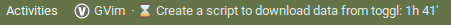
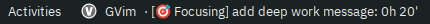

# Toggl Live Track

Toggl live track is a small script that I use in combination with [executor](https://github.com/raujonas/executor) gnome shell extension to display the current time entry running on [Toggl](https://track.toggl.com/timer) in the top bar. That let me be more time aware whenever I'm working with the computer.

An image is worth a thousand words (except if you take a photo of a text with more than 1000 words, of course)

If you find it interesting and want to give a go, just:
1. Install a virtual environment (pyenv does not work): `python3 venv venv/`
2. Install requirements `pip install -r requirements.txt`
3. Clone `env_sample` and fill it with your toggl details.
4. Go to executor extension and add the path to your script:
`cd path/to/live_track && source venv/bin/activate && source .env && python live_track.py`

Depending the global installation on your computer you might not even need a virtual environment (just `requests` is needed out from the standard library)

That easy!

## Deep work tag
If you are a fan of deep work like me, you might find useful assigning a deep work tag to your entries (chances are you are already using one). You can define the name of that tag in the beginning of the file that in turn will add a focusing label to your entry on the top panel. Again, a picture is worth a thousand words:

